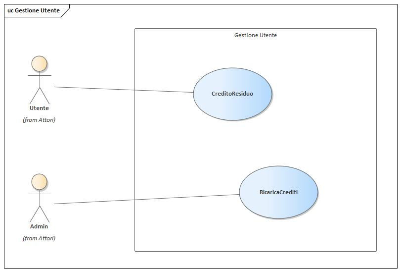

# Inference Management System Armocromia
<p align="center">
  
</p>

## Obiettivo del Progetto

Il progetto consiste nella realizzazione di un sistema backend per la gestione delle inferenze su immagini, video e file zip, utilizzando modelli di Deep Learning pre-addestrati per l'armocromia. Il sistema permette agli utenti di creare dataset, caricare contenuti, eseguire inferenze e gestire crediti attraverso un sistema di autenticazione JWT. I modelli messi a disposizioni restituiscono, data un'immagine in input, la propabilità che quest'ultima appartenga ad una data classe come ad esempio primavera, autunno, inverno... per il modello a 4 classi, summer light, autunno deep... per il modello a 12 classi (in cui vengono individuate 3 sottocategorie per ciascuna stagione).

## Progettazione DB
Di seguito riportiamo il diagramma E-R (Entity-relationship) utilizzato per la progettazione del database. Quest'ultimo è basato su MySQL ed è stato impostato su un server esterno. Il diagramma mostra quattro entità: *Users*, *Contents*, *Datasets* e *Inferences*, ciscuno dei quali con i propri attributi.

<p align="center">
  
</p>

## Analisi dei requisiti


### Diagramma dei Casi d'Uso
#### Attori

#### Gestione Dataset

#### Gestione Processamento

#### Gestione Utente



### Diagramma delle Sequenze
#### Caricamento immagine
Il funzionameneto è simile per il caricamento dello zip o dei video.

#### Credito residuo

#### CRUD Dataset

#### Ignorare formati non corretti

#### Restituzione ID processamento

#### Ricarica crediti

#### Richiesta inferenza

#### Risultato inferenza

#### Stato di avanzamento

#### Validazione crediti


### Design Pattern Utilizzati

1. **Factory Pattern**: Utilizzato per creare istanze dei modelli di inferenza in base all'ID fornito dall'utente.
2. **Singleton Pattern**: Utilizzato per la gestione della connessione al database.
3. **Strategy Pattern**: Utilizzato per differenziare la logica di caricamento di immagini, zip e video.
4. **Middleware Pattern**: Utilizzato per la gestione delle autenticazioni e validazioni delle richieste.

## Avvio del Progetto

### Requisiti
- Docker
- Docker Compose

### Istruzioni per l'Avvio
1. Clonare il repository:
   ```bash
   git clone https://github.com/yourusername/inference-management-system.git
   cd inference-management-system

